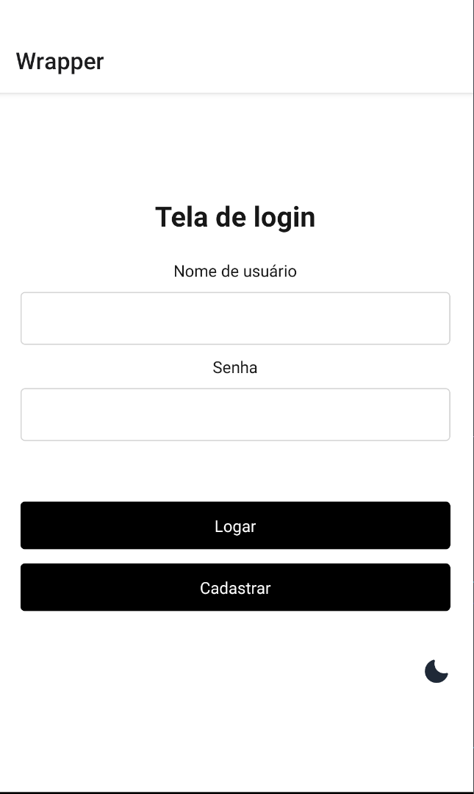
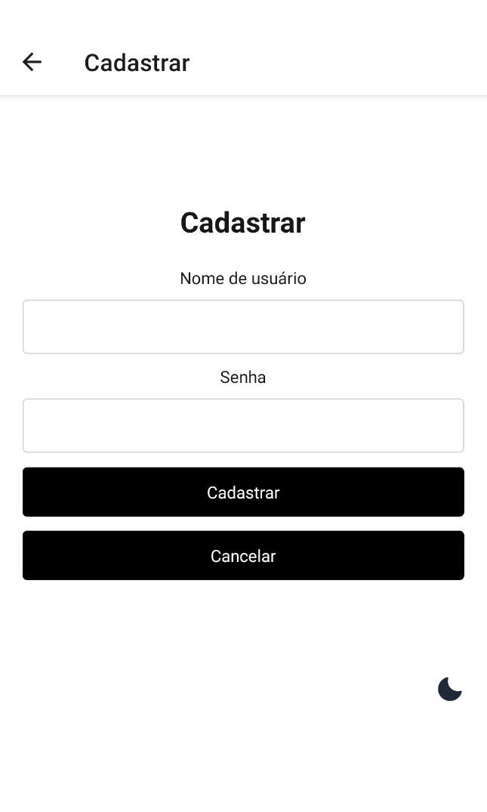
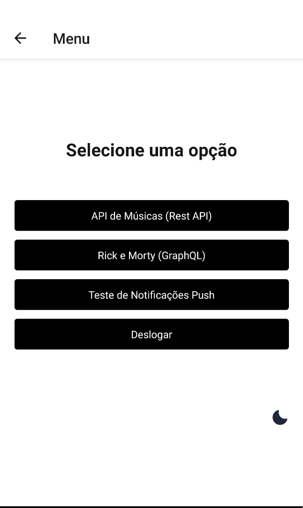
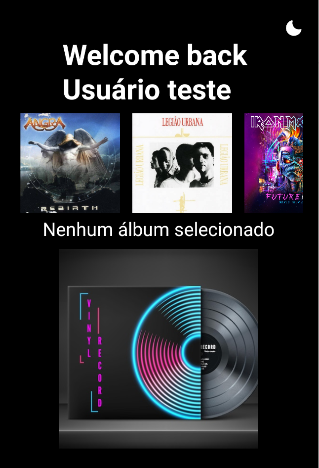
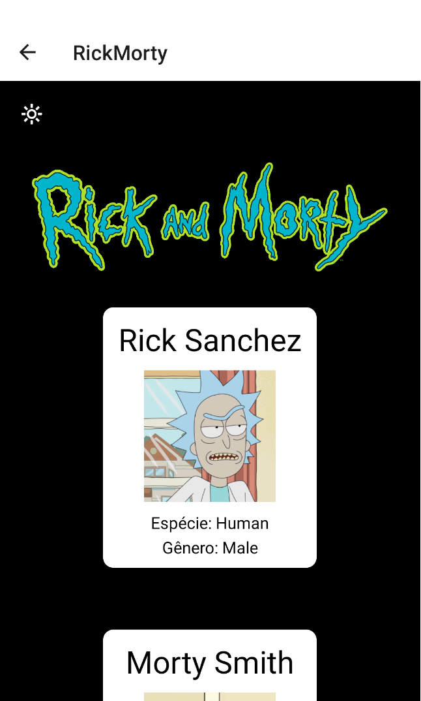
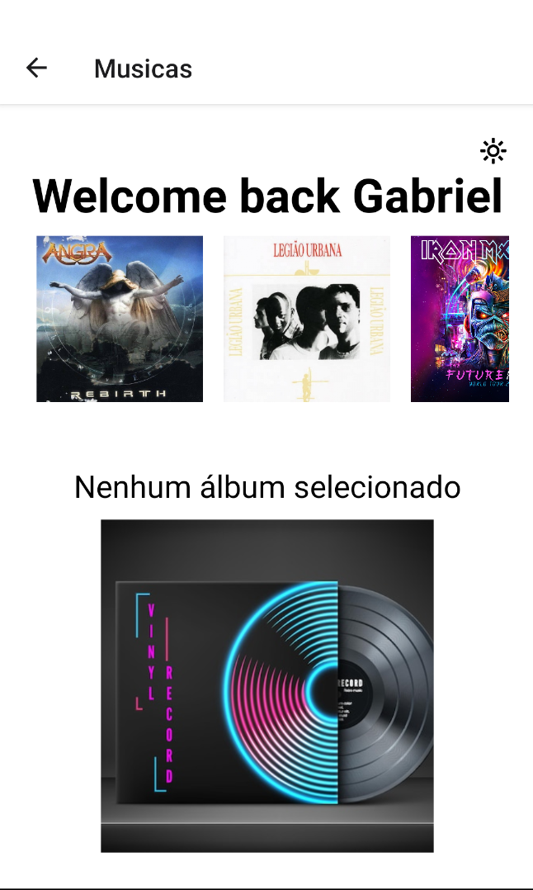
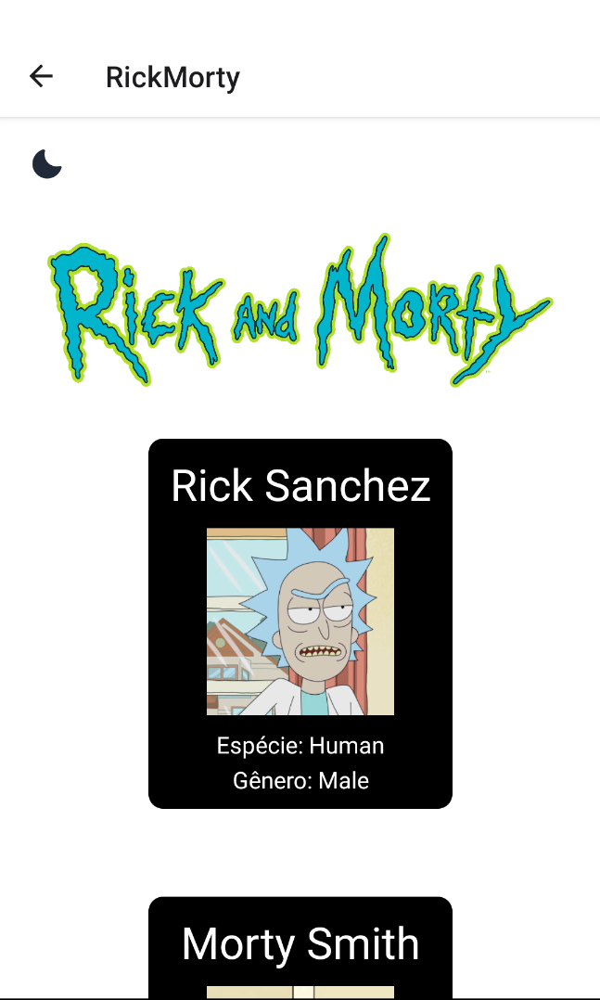

# Aplicativo Spotify / Personagens Rick Morty
Aplicativo sem uso específico, feito para pós graduação mobile, para aprendizado de tecnologias de React Native, Expo, notificações push, modo noturno, requests em RestApi e GraphQL.

## Tecnologias utilizadas
- Native Base
- Push Expo
- ContextAPI
- Componentes
- Integração com o Firebase

## Prints da aplicação:

### Tela de login com autenticação:

### Tela de cadastro:

### Lista de opções do aplicativo de testes:

### Consumo de API de música (RestApi):

### Consumo de API Rick Morty (GraphQL):

### Tema escuro/Tema claro
## Tema Escuro

## Tema Claro

